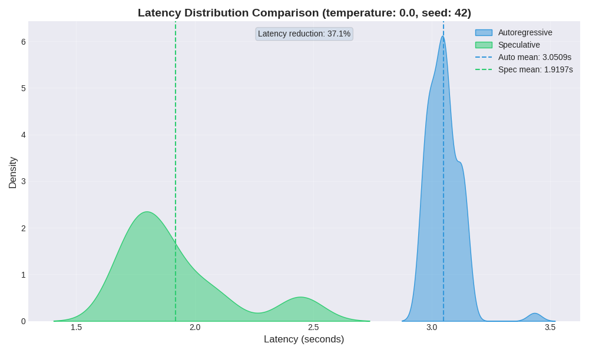
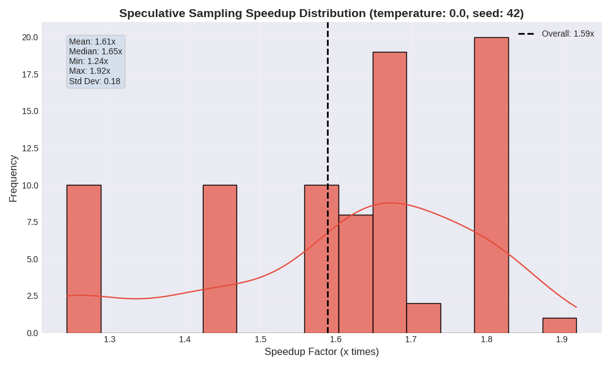
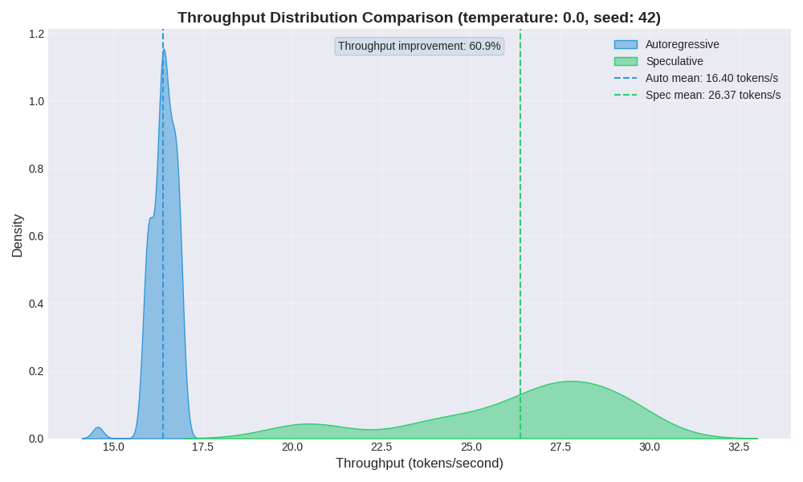
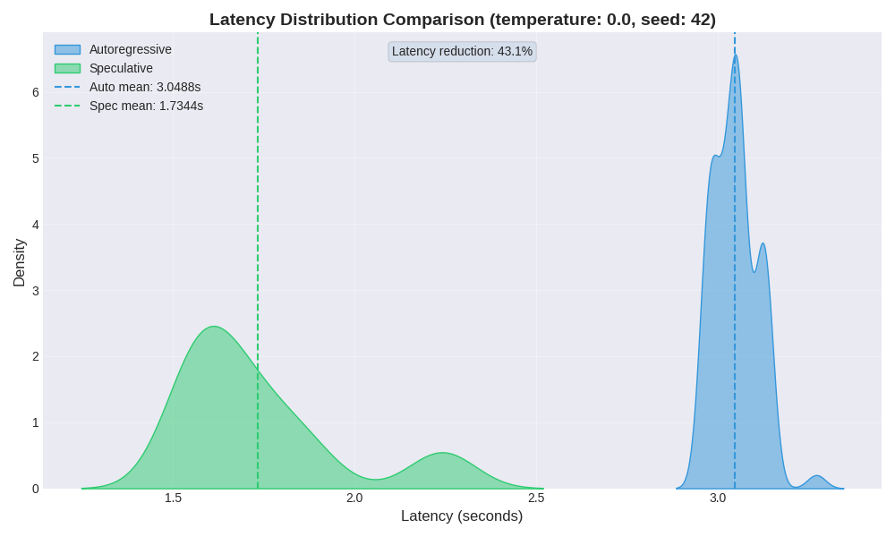
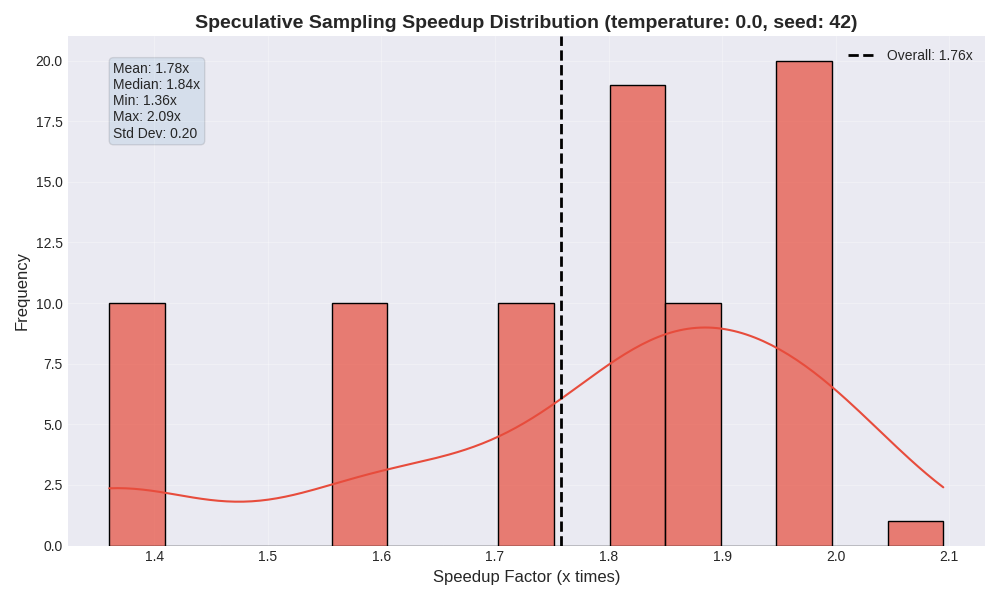
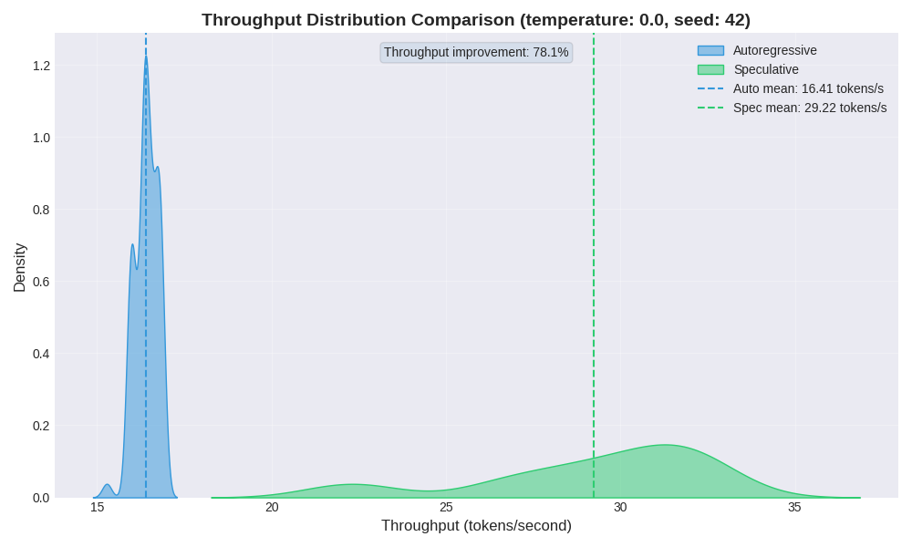

# Fabula

Inference from large LLMs is slow - decoding K tokens takes K serial runs of the model. That's why exists approach known as speculative decoding - an algorithm to sample from autoregressive models faster without any changes to the outputs, by computing several tokens in parallel.

This repository is a stand where you can run any prompt via classic autoregressive decoding and at the same time via speculative decoding. For any detailed information run:
```bash
    python3 src/main.py -h
```

By default there are pre-trained draft and target LLMs. Feel free to change models. Also you can run fine-tuned model by uncommenting two lines of code in main file.

You can run model finetuning by:
```bash
    python3 src/finetune_draft_model.py
```

### Articles:
* https://arxiv.org/abs/2302.01318
* https://arxiv.org/abs/2211.17192
* https://arxiv.org/abs/2503.07807

P.S. Careful with `CUDA_DEVICE` constant! Maybe you will need to change it.

Results `(temperature = 0)`:

* With fine-tuning:




* Without:


